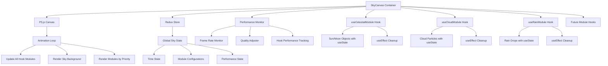

# Technical Design

## Overview
The background sky system implements a modular atmospheric effects system using P5.js canvas. The sky canvas serves as a container that manages multiple self-contained atmospheric modules (celestial objects, clouds, rain, etc.), each with their own lifecycle and rendering logic.

## Architecture

### Modular Component Structure
```
SkyCanvas Container Component
├── P5.js Canvas Instance
├── Day/Night Cycle Controller
├── Performance Monitor
├── Module Manager
└── Animation Loop
    ├── CelestialModule (sun/moon)
    ├── CloudModule (clouds, weather)
    ├── RainModule (rain effects)
    └── FutureModules (snow, fog, etc.)
```

### Data Flow
1. **Initialization:** SkyCanvas mounts → P5.js setup → Module registry created
2. **Module Loading:** Enabled modules initialize → Register with canvas
3. **Animation Loop:** P5.js draw() → Update all modules → Render sky → Render modules
4. **State Management:** Redux store manages global sky state, modules manage local state
5. **Performance:** Frame rate monitoring → Module-specific quality adjustments

## Components and Interfaces

### SkyCanvas Container Component
```typescript
interface SkyCanvasProps {
  width: number;
  height: number;
  timeMultiplier?: number;
  enablePerformanceMode?: boolean;
  enabledModules?: SkyModuleType[];
}

interface SkyState {
  currentTime: number;
  dayProgress: number;
  skyColors: SkyColors;
  performanceMode: boolean;
  activeModules: Record<SkyModuleType, boolean>;
}

type SkyModuleType = 'celestial' | 'clouds' | 'rain' | 'snow' | 'fog';
```

### Atmospheric Module Hook Interface
```typescript
interface SkyModuleHook {
  type: SkyModuleType;
  name: string;
  isActive: boolean;
  priority: number; // Render order
  isInitialized: boolean;
  
  initialize(p5: p5, config: ModuleConfig): void;
  update(p5: p5, deltaTime: number, globalState: SkyState): void;
  render(p5: p5, globalState: SkyState): void;
  setPerformanceMode(mode: 'high' | 'medium' | 'low'): void;
  // No destroy method needed - useEffect handles cleanup automatically
}

interface ModuleConfig {
  canvasWidth: number;
  canvasHeight: number;
  performanceMode: 'high' | 'medium' | 'low';
  customSettings?: Record<string, any>;
}
```

### Celestial Module Hook (Example Implementation)
```typescript
// React hook for celestial module
const useCelestialModule = (config: ModuleConfig): SkyModuleHook => {
  const [sun, setSun] = useState<SunObject | null>(null);
  const [moon, setMoon] = useState<MoonObject | null>(null);
  const [isInitialized, setIsInitialized] = useState(false);
  const [performanceMode, setPerformanceMode] = useState<'high' | 'medium' | 'low'>('high');

  const initialize = useCallback((p5: p5) => {
    setSun(new SunObject(config));
    setMoon(new MoonObject(config));
    setIsInitialized(true);
  }, [config]);

  const update = useCallback((p5: p5, deltaTime: number, globalState: SkyState) => {
    if (sun && moon && isInitialized) {
      sun.update(deltaTime, globalState.dayProgress);
      moon.update(deltaTime, globalState.dayProgress);
    }
  }, [sun, moon, isInitialized]);

  const render = useCallback((p5: p5, globalState: SkyState) => {
    if (!isInitialized) return;
    
    if (globalState.dayProgress < 0.5) {
      sun?.render(p5);
    } else {
      moon?.render(p5);
    }
  }, [sun, moon, isInitialized]);

  // Automatic cleanup on unmount
  useEffect(() => {
    return () => {
      setSun(null);
      setMoon(null);
      setIsInitialized(false);
    };
  }, []);

  return {
    type: 'celestial',
    name: 'Celestial Objects',
    isActive: true,
    priority: 100,
    isInitialized,
    initialize,
    update,
    render,
    setPerformanceMode
  };
};

interface CelestialObject {
  type: 'sun' | 'moon';
  position: Vector2D;
  size: number;
  brightness: number;
  glowRadius: number;
  trail: Vector2D[];
}

interface SkyColors {
  top: string;
  middle: string;
  bottom: string;
  horizon: string;
}
```

## Data Models

### Redux Store Structure
```typescript
interface SkySlice {
  global: {
    currentTime: number;
    dayDuration: number;
    timeMultiplier: number;
    dayProgress: number;
  };
  sky: {
    colors: SkyColors;
    baseColor: string;
  };
  modules: {
    enabled: Record<SkyModuleType, boolean>;
    configurations: Record<SkyModuleType, ModuleConfig>;
  };
  performance: {
    frameRate: number;
    globalQualityMode: 'high' | 'medium' | 'low';
    moduleQualityModes: Record<SkyModuleType, 'high' | 'medium' | 'low'>;
  };
}
```

### Animation Parameters
```typescript
interface AnimationConfig {
  sunPath: EllipticalPath;
  moonPath: EllipticalPath;
  transitionDuration: number;
  glowIntensity: number;
  atmosphericEffects: boolean;
}
```

## Error Handling

### Canvas Initialization Errors
- **Fallback:** Graceful degradation to static sky
- **Recovery:** Automatic retry with reduced settings
- **Logging:** Error tracking for debugging

### Performance Degradation
- **Adaptive Quality:** Automatic quality reduction
- **Frame Rate Monitoring:** Real-time performance tracking
- **User Notification:** Optional performance warnings

### Browser Compatibility
- **WebGL Fallback:** Canvas 2D rendering when WebGL unavailable
- **Feature Detection:** Progressive enhancement approach
- **Mobile Optimization:** Touch-friendly adjustments

## Testing Strategy

### Unit Tests
- **Celestial Object Calculations:** Position, movement, transitions
- **Color Interpolation:** Day/night color blending
- **Performance Monitoring:** Frame rate calculations

### Integration Tests
- **Redux Integration:** State management flow
- **P5.js Integration:** Canvas lifecycle management
- **Component Integration:** React component mounting/unmounting

### Performance Tests
- **Frame Rate Validation:** Consistent 60fps maintenance
- **Memory Usage:** Object pooling effectiveness
- **Rendering Optimization:** Draw call efficiency

## Technical Decisions

### Key Architectural Choices

**1. P5.js vs Native Canvas API**
- **Choice:** P5.js
- **Rationale:** Simplified animation loops, built-in math utilities, consistent API
- **Alternative:** Native Canvas API (more control but complex implementation)

**2. Redux vs Local State**
- **Choice:** Redux for sky state
- **Rationale:** Global state management, time synchronization with other effects
- **Alternative:** Local component state (simpler but less integration)

**3. Elliptical vs Linear Movement**
- **Choice:** Elliptical paths for celestial objects
- **Rationale:** More realistic celestial movement, visually appealing
- **Alternative:** Linear movement (simpler but less realistic)

### Performance Optimizations
- **Object Pooling:** Reuse celestial object instances
- **Adaptive Rendering:** Quality reduction on low-end devices
- **Efficient Color Calculations:** Pre-calculated color palettes
- **Trail Management:** Limited trail length for memory efficiency

## Mermaid Diagram: React Hooks-Based Sky System Architecture


